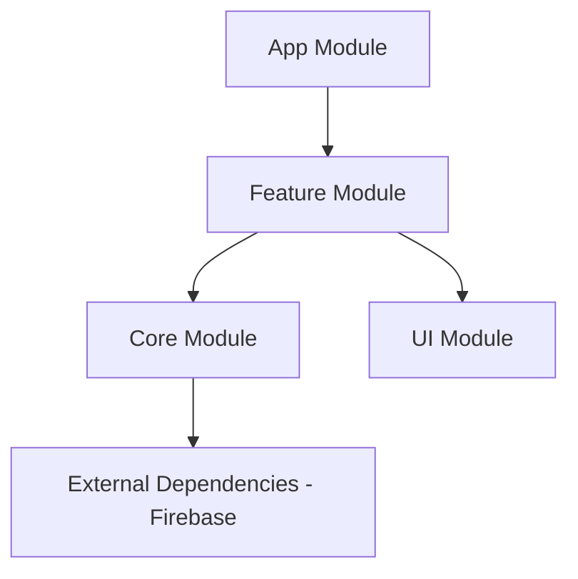

# Jip-coon (집쿤)

> **가족 구성원이 함께하는 게이미피케이션 집안일 관리 앱**

## App Store
<a href="https://apps.apple.com/au/app/%EC%A7%91%EC%BF%A4/id6751805920">
 
</a>

## 📖 프로젝트 소개
**Jip-coon(집쿤)** 은 가족 구성원들이 집안일을 퀘스트처럼 수행하고 보상을 받으며, 집안일을 놀이처럼 즐길 수 있도록 돕는 서비스입니다.
딱딱하고 지루한 집안일 관리가 아닌, 가족 간의 소통과 경쟁을 유도하여 자발적인 참여를 이끌어내는 것을 목표로 했습니다.

- **개발 기간**: 2025.08 ~ 2026.02
- **개발 인원**: iOS 2명
- **역할**:
    - **심관혁**: 추후 작성 예정
    - **김예슬**: 추후 작성 예정

## ✨ 핵심 기능

### 1. 퀘스트(집안일) 관리
- 집안일을 ‘퀘스트’로 등록하고 담당자를 지정할 수 있습니다.
- 할당받은 퀘스트를 완료하고 승인을 요청합니다.
- 사용자가 담당한 퀘스트와 가족의 퀘스트를 확인할 수 있습니다.
- 알림을 통해 퀘스트 수행에 동기 부여를 합니다.

### 2. 가족 관리
- 초대 코드를 통해 간편하게 가족 그룹을 생성하고 멤버를 초대할 수 있습니다.
- 부모/자녀 역할을 구분하여 권한을 관리합니다.

### 3. 게이미피케이션 (Gamification)
- 퀘스트 완료 보상으로 포인트를 획득합니다.
- 가족 구성원 간의 랭킹 시스템을 통해 경쟁 요소를 도입했습니다.

### 4. 소셜 로그인
- Apple 로그인
- Google 로그인
- 이메일 회원가입 및 로그인

## 🛠 기술 스택 (Tech Stack)

| Category | Stacks |
| --- | --- |
| **Language** | Swift 6.1.2, TypeScript 5.9.3 |
| **Runtime** | Node.js 22 (Cloud Functions) |
| **UI Framework** | UIKit (Code-based) |
| **Architecture** | MVVM |
| **Reactive Framework** | Combine |
| **Project Structure** | Modular Architecture (Tuist) |
| **Dependency Manager** | Swift Package Manager (via Tuist) |
| **Backend** | Firebase (Firestore, Auth, Cloud Functions, FCM) |
| **Libraries** | Lottie, GoogleSignIn |
| **Collaboration** | GitHub, Slack, Figma, Jira |

## 🏗 아키텍처 (Architecture)

본 프로젝트는 **Tuist**를 활용한 모듈러 아키텍처(Modular Architecture)를 채택하여, 빌드 속도를 최적화하고 기능 간 결합도를 낮췄습니다.



- **App**
  - 애플리케이션의 진입점
  - AppDelegate/SceneDelegate 포함
  - 의존성 주입 및 루트 플로우 설정
- **Feature**
  - 화면 단위 기능 모듈
  - Scene(ViewController), ViewModel
  - 사용자 이벤트를 Service 계층과 연결
- **Core**
  - 도메인 모델 정의
  - Firebase 기반 Service 레이어 구현
- **UI**
  - 디자인 시스템, 리소스 관리
  - Extension 관리

## 🔧 아키텍처 설계 및 기술 선택

### 1. Tuist 기반의 모듈화 도입
프로젝트 초기 단계에서 기능 확장과 유지보수를 고려하여  
모듈화된 구조로 설계하고자 Tuist를 도입했습니다.

- `Feature`, `UI`, `Core` 모듈로 책임을 분리
- 도메인 로직(Service, Model)과 화면 계층을 명확히 분리
- 의존성 방향을 단방향으로 설계하여 구조적 안정성 확보

**결과**
- 기능 단위로 명확하게 역할이 구분되어 코드 가독성과 유지보수성이 향상되었습니다.
- 의존성 그래프를 통해 구조를 시각적으로 관리할 수 있었습니다.

### 2. Combine을 활용한 반응형 UI 구현 (MVVM)

UI 상태와 비동기 데이터 흐름을 명확히 분리하기 위해  
MVVM 패턴과 Combine을 기반으로 구조를 설계했습니다.

- ViewModel에서 Input / Output 구조를 정의
- 사용자 이벤트와 네트워크 결과를 데이터 스트림으로 관리
- `@Published`, `PassthroughSubject`를 활용하여 상태 변화를 바인딩

**결과**
- ViewController의 역할을 UI 렌더링으로 제한하여 책임을 분리했습니다.
- 비동기 로직이 ViewModel에 집중되어 테스트 및 유지보수가 용이해졌습니다.

## 📱 실행 화면

| 로그인 | 홈 (퀘스트 목록) | 퀘스트 상세 | 가족 관리 |
| :---: | :---: | :---: | :---: |
||||
추가예정

## 📂 Project Structure

```
📦Projects
 ┣ 📂App
 ┃ ┣ 📂Derived
 ┃ ┣ 📂Resources
 ┃ ┗ 📂Sources
 ┣ 📂Core
 ┃ ┣ 📂Sources
 ┃ ┃ ┣ 📂Auth
 ┃ ┃ ┣ 📂Model
 ┃ ┃ ┗ 📂Service
 ┣ 📂Feature
 ┃ ┣ 📂Scenes
 ┃ ┃ ┣ 📂Auth
 ┃ ┃ ┃ ┣ 📂LoginScene
 ┃ ┃ ┃ ┃ ┣ 📂View
 ┃ ┃ ┃ ┃ ┗ 📂ViewModel
 ┃ ┃ ┃ ┣ 📂SignUpScene
 ┃ ┃ ┃ ┃ ┣ 📂View
 ┃ ┃ ┃ ┃ ┗ 📂ViewModel
 ┃ ┃ ┃ ┗ 📂SplashScene
 ┃ ┃ ┣ 📂Gamification
 ┃ ┃ ┃ ┗ 📂RankingScene
 ┃ ┃ ┃ ┃ ┣ 📂View
 ┃ ┃ ┃ ┗ ┗ 📂ViewModel
 ┃ ┃ ┣ 📂Home
 ┃ ┃ ┃ ┣ 📂FamilyCreationScene
 ┃ ┃ ┃ ┃ ┗ 📂View
 ┃ ┃ ┃ ┣ 📂HomeScene
 ┃ ┃ ┃ ┃ ┣ 📂View
 ┃ ┃ ┃ ┃ ┗ 📂ViewModel
 ┃ ┃ ┃ ┣ 📂MainScene
 ┃ ┃ ┃ ┃ ┣ 📂View
 ┃ ┃ ┃ ┃ ┗ 📂ViewModel
 ┃ ┃ ┃ ┣ 📂MyTasksScene
 ┃ ┃ ┃ ┃ ┗ 📂View
 ┃ ┃ ┃ ┣ 📂NotificationScene
 ┃ ┃ ┃ ┃ ┣ 📂View
 ┃ ┃ ┃ ┃ ┗ 📂ViewModel
 ┃ ┃ ┃ ┣ 📂UrgentQuestScene
 ┃ ┃ ┃ ┗ ┗ 📂View
 ┃ ┃ ┣ 📂Quest
 ┃ ┃ ┃ ┣ 📂AddQuestScene
 ┃ ┃ ┃ ┃ ┣ 📂View
 ┃ ┃ ┃ ┃ ┃ ┣ 📂Components
 ┃ ┃ ┃ ┃ ┗ 📂ViewModel
 ┃ ┃ ┃ ┣ 📂AllQuestScene
 ┃ ┃ ┃ ┃ ┣ 📂View
 ┃ ┃ ┃ ┃ ┃ ┣ 📂Components
 ┃ ┃ ┃ ┃ ┗ 📂ViewModel
 ┃ ┃ ┃ ┣ 📂ApprovalScene
 ┃ ┃ ┃ ┃ ┣ 📂View
 ┃ ┃ ┃ ┃ ┃ ┣ 📂Cells
 ┃ ┃ ┃ ┃ ┗ 📂ViewModel
 ┃ ┃ ┃ ┣ 📂QuestDetailScene
 ┃ ┃ ┃ ┃ ┣ 📂View
 ┃ ┃ ┃ ┗ ┗ 📂ViewModel
 ┃ ┃ ┣ 📂Setting
 ┃ ┃ ┃ ┣ 📂FamilyManageScene
 ┃ ┃ ┃ ┣ 📂NotificationSettingScene
 ┃ ┃ ┃ ┃ ┣ 📂View
 ┃ ┃ ┃ ┃ ┗ 📂ViewModel
 ┃ ┃ ┃ ┣ 📂ProfileEditScene
 ┃ ┃ ┃ ┃ ┣ 📂View
 ┃ ┃ ┃ ┃ ┗ 📂ViewModel
 ┃ ┃ ┃ ┣ 📂SettingScene
 ┃ ┃ ┃ ┃ ┣ 📂View
 ┃ ┣ ┗ ┗ ┗ 📂ViewModel
 ┣ 📂UI
 ┃ ┣ 📂Resources
 ┃ ┃ ┣ 📂Fonts
 ┃ ┃ ┣ 📂Images.xcassets
 ┃ ┣ 📂Sources
 ┗ ┗ ┗ 📂Extensions
 ```